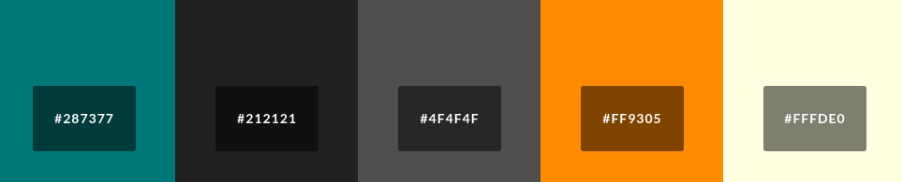
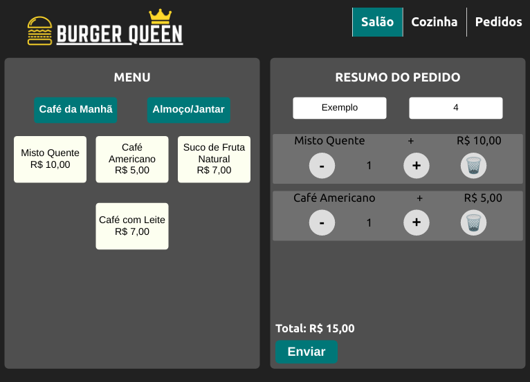
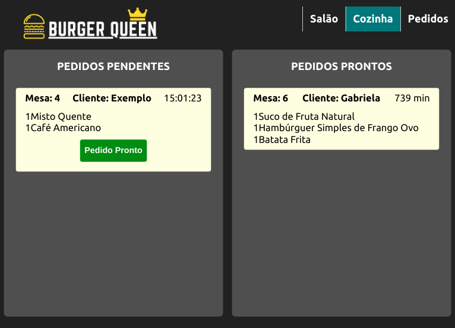
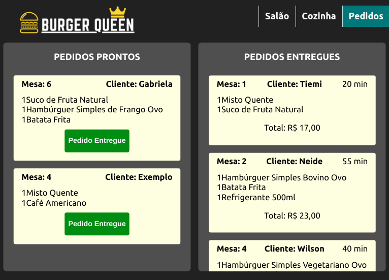

# Burger Queen

## Índice

* [1. Burger Queen](#1-burger-queen)
* [2. Resumo do projeto](#2-resumo-do-projeto)
* [3. Histórias de Usuário](#3-histórias-de-usuário)
* [4. Tecnologias](#4-tecnologias)
* [5. Como Usar](#5-como-usar)

***

## 1. Burger Queen

Burger Queen foi um projeto desenvolvido para a Laboratória, como parte do processo de aprendizagem do bootcamp. O objetivo principal foi aprender a construir uma interface web usando React.

## 2. Resumo do projeto

Um pequeno restaurante de hambúrgueres, que está crescendo, necessita uma interface em _Single Page App_ em que se possa realizar pedidos utilizando um _tablet_, e enviá-los para a cozinha para que sejam preparados de forma ordenada e eficiente.

A interface mostra dois menus (café da manhã e restante do dia), cada um com todos os seus _produtos_. O usuário deve poder escolher que _produtos_ adicionar e a interface deve mostrar o _resumo do pedido_ com o custo total.

### Paleta de cores

## 3. Histórias de Usuário

#### [HU 1] Cliente deve poder anotar o seu pedido

Eu como cliente quero poder anotar o meu pedido saber o valor de cada 
produto e poder enviar o pedido para a cozinha para ser preparado.

#### [HU 2] Chefe de cozinha deve ver os pedidos

Eu como chefe de cozinha quero ver os pedidos dos clientes em ordem, poder marcar que estão prontos e poder notificar os garçons/garçonetes que o pedido está pronto para ser entregue ao cliente.

#### [HU 3] Garçom/Garçonete deve ver os pedidos prontos para servir

Eu como garçom/garçonete quero ver os pedidos que estão prontos para entregá-los rapidamente aos clientes.

 
## 4. Tecnologias

* HTML5
* JavasScript (ES6)
* Firebase
* Aphrodite (CSS)
* React Hooks
* growl-alert

## 5. Como Usar

#### Aba Salão
O usuário que anotará o pedido pode escolher entre os menus (Café da Manhã ou Almoço/Jantar) selecionando os itens desejados, depois marcando o nome do cliente e mesa. 

Será mostrado em tempo real o resumo do pedido, podendo aumentar, diminuir ou excluir algum item antes de enviar o pedido à cozinha. 

#### Aba Cozinha
O usuário da cozinha visualiza os pedidos pendentes e pode marcar o pedido como pronto. 

#### Aba Pedidos
O usuário pode visualizar a lista de pedidos prontos para servir e marcar como entregue.

